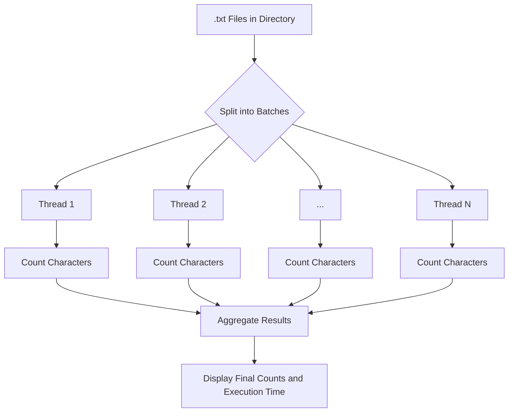

# 📝 Text File Character Counter

**Subject:** Performance in Cyber-Physical Systems
**Author:** Guilherme Montoya (Yashic)

A Java program that counts character occurrences in `.txt` files from a directory, using **multithreading** for optimized performance.

---

## 🚀 Features

* ✅ **Multithreaded processing** for efficient file reading
* ✅ Character frequency counting (A-Z, case insensitive)
* ✅ Execution time measurement
* ✅ Optimized for both small (100 files) and large (35,000 files) datasets
* ✅ Automatic thread count based on available processors

---

## 🛠️ Implementation Details

### 📂 Core Logic

1. **File Discovery:**
   Scans the specified directory for `.txt` files.

2. **Thread Management:**

   * Files are evenly divided into batches.
   * Each thread processes its assigned batch.

3. **Character Counting:**

   * Converts text to uppercase.
   * Counts occurrences of characters A-Z, ignoring others.

4. **Result Aggregation:**

   * Merges results from all threads.
   * Displays final character counts and processing statistics.

---

## ⚙️ Thread Optimization

The number of threads is automatically calculated based on the number of available processors:

```java
int numThreads = Runtime.getRuntime().availableProcessors();
```

You can also manually set the thread count if desired.

---

## 📊 Visual Representation of Processing



This diagram illustrates how the files are divided among multiple threads, each counting characters in parallel, and finally aggregating the results.

---

## ⏱️ Performance Considerations

* ✅ Tested with both sample (100 files) and production (35,000 files) datasets.
* ✅ Thread count can be adjusted for specific hardware configurations.
* ✅ Execution time is displayed for benchmarking purposes.

---

## 🏁 How to Use

1. Unzip the folders:
```
-------------------------------------------------------
Current dir: /user/path/project/All
-------------------------------------------------------
```
```bash
unzip sample.zip
```
```
-------------------------------------------------------
Current dir: /user/path/project/All
-------------------------------------------------------
```
```bash
unzip all_files.zip
```

2. Compile the program:
```bash
javac Main.java
```

3. Run the program:
```bash
java Main
```

4. View the output in the console:

   * Total number of files processed.
   * Successfully processed files.
   * Files with errors (if any).
   * Character frequency counts.
   * Total execution time.

---

## 📦 Code Structure

```java
public class CharacterCounter {
    // Main components:
    // - File discovery and validation
    // - Thread creation and management
    // - Character counting logic
    // - Result aggregation and display
}
```

---

## ✅ My Sample Output

```
-------------------------------------------------------
Current dir: /user/path/project
-------------------------------------------------------
Number of .txt files to process: 34055
Using 12 threads

Processing summary:
Total files: 34055
Successfully processed: 34055
Files with errors: 0
Time elapsed: 923 ms

Contagem consolidada de letras:
A: 7584025
B: 710564
C: 2248600
D: 3228111
E: 6765352
F: 707274
G: 808970
H: 542937
I: 4239239
J: 238301
K: 49950
L: 1937723
M: 2473287
N: 3188020
O: 6471878
P: 1897361
Q: 478992
R: 4344514
S: 4499835
T: 2943839
U: 2256073
V: 808644
W: 39818
X: 176301
Y: 45953
Z: 215838
```

---

## 🔧 Technical Notes

* Case-insensitive counting: A-Z treated the same as a-z.
* Non-alphabetic characters are ignored.
* Efficient file handling using `java.nio` and buffered reading.
* Designed for modern multi-core processors for maximum performance.

---